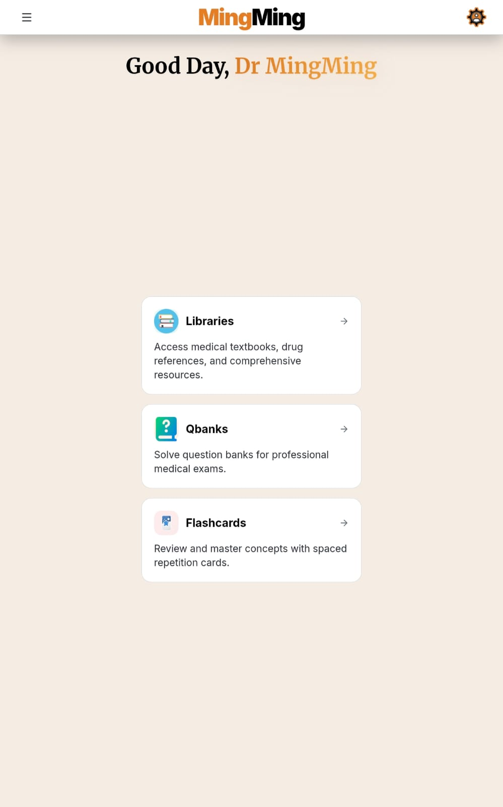
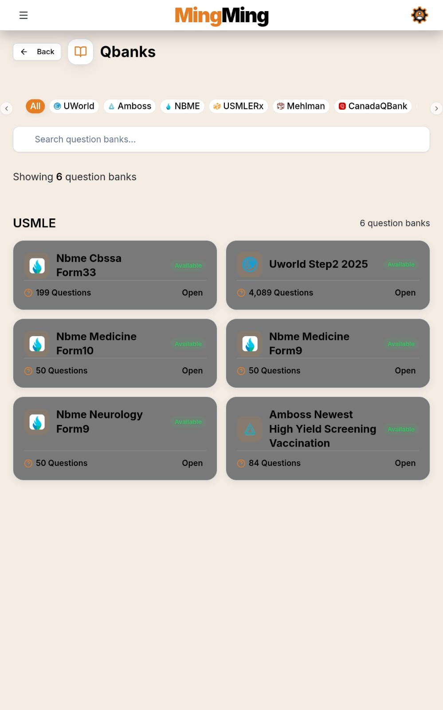
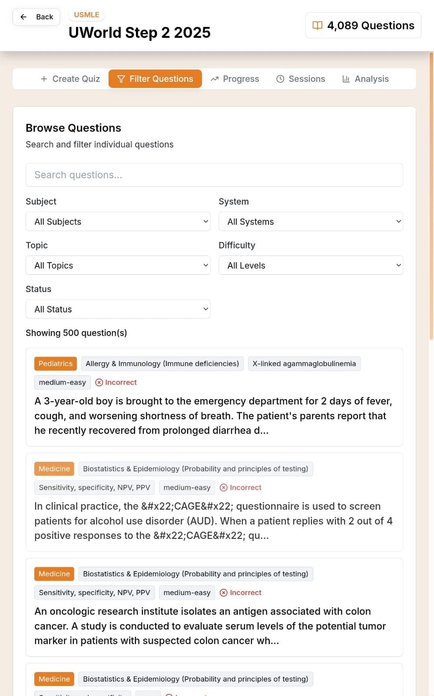
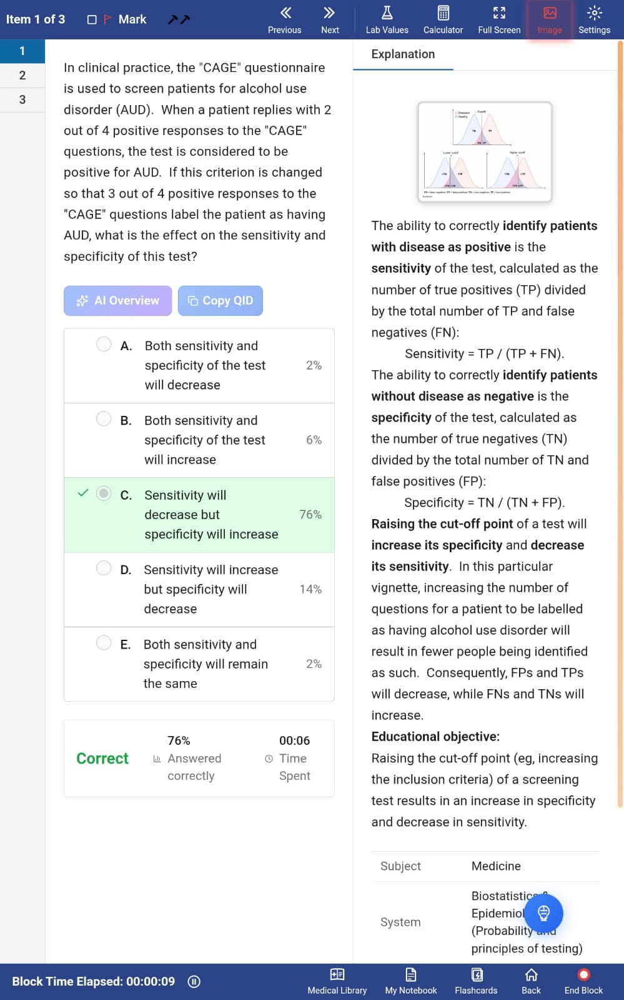
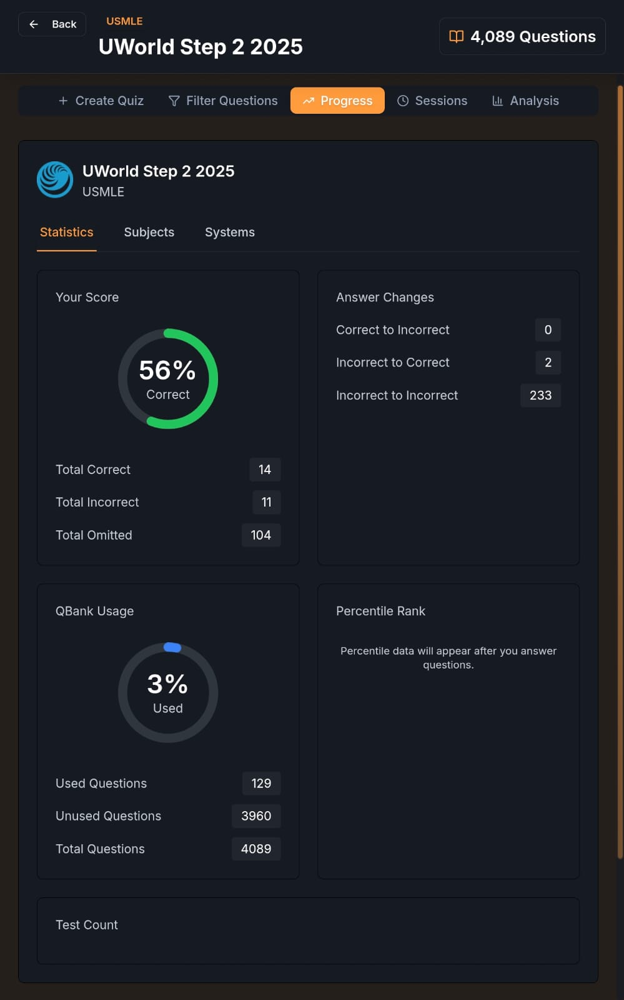
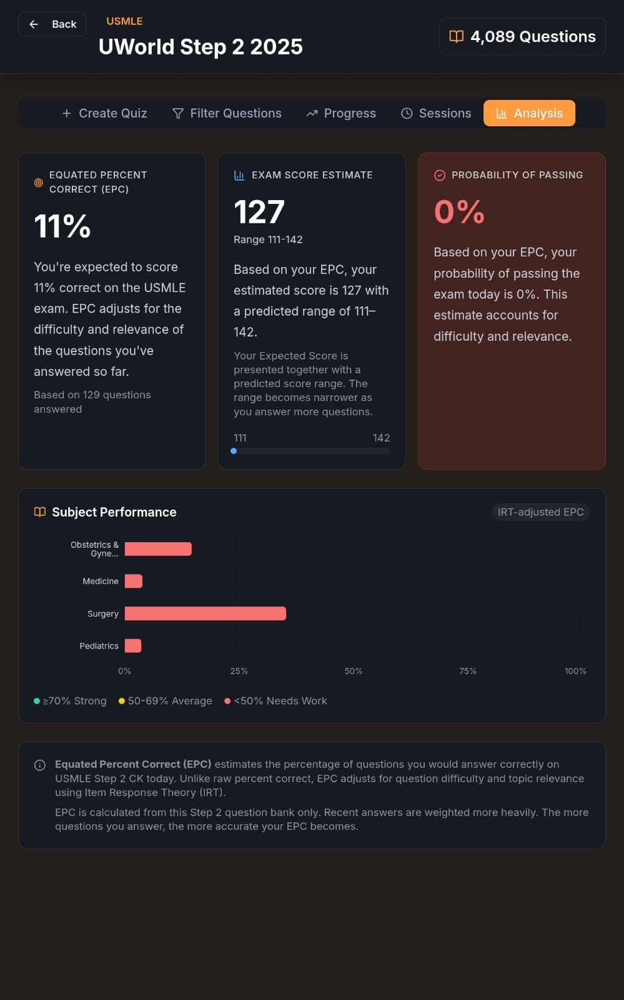
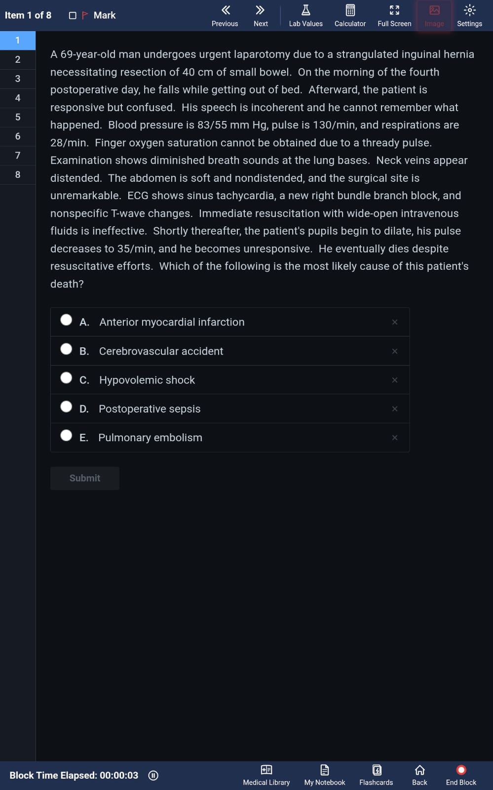
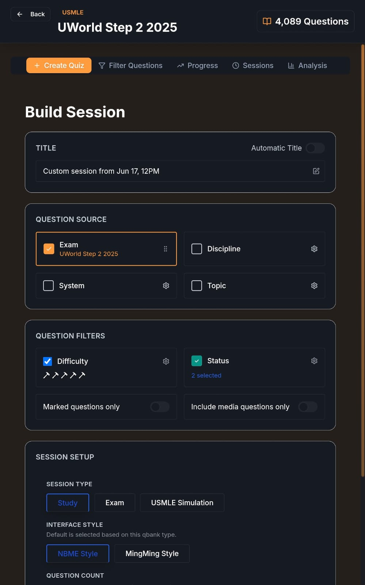

# MingMing

Your all-in-one study companion for medical exam preparation.

[](https://t.me/mingming_khan)


https://github.com/user-attachments/assets/907f9b20-f454-4a28-9bff-c939d8ebbc78


## Download

Go to [**Releases**](https://github.com/Grung-khan/MingMing-releases/releases) to download the latest version.

| Platform | File | Notes |
|---|---|---|
| Windows | `MingMing Setup X.Y.Z.exe` | Run installer, follow prompts |
| Android | `MingMing-X.Y.Z.apk` | Enable "Install from unknown sources" if needed |

## About

MingMing is a free, offline-first app designed specifically for medical students to practice questions from world-renowned Qbank companies like **uWorld**, **Amboss**, **USMLE-Rx**, **Mehlman**, **NBME**, and others.

**MingMing runs entirely on your device.** All your data stays local — no account, no cloud, no tracking. Internet is only needed for AI features (Gemini integration with a free API key).

## Features

### Content & Resources
- Qbanks available for free: **uWorld**, **Amboss**, **Mehlman**, **USMLE-Rx**, **BMJ**, **Prometric**, **Amedex**, **BoardVitals**, **AceQBank**, **PassMedicine**, **CanadaQBank**, **MPlusX**
- 4 Libraries: **Amboss Library**, **uWorld Library**, **UpToDate Library**, **Lexi-Drugs**
- 2 uWorld readydeck flashcard decks

### Beautiful, Polished UI
- Clean, intuitive interface
- 7 themes: **Light**, **Dark Mode**, **Surgical Scrub**, **Petri Dish**, **Champion Gold**, **Biohazard**, **Neon Virus**

### Customizable Study Sessions
- Build a personalized session by **discipline**, **system**, and **topic**
- Choose between **Study Mode** or **Exam Mode**
- Option to **include previously incorrect questions**
- **Flag** any question for later review
- **Resume** unfinished sessions

### Session Interface Styles
- Choose from **NBME**, **Amboss**, or **MingMing** interface styles
- Unique, intuitive default **MingMing style**
- Amboss Qbanks open in Amboss mode by default; uWorld and NBMEs in NBME mode; others in MingMing mode
- Create **simulation sessions** for uWorld Qbanks

### During a Session
- **Highlight text** with various colors
- **Create custom flashcards** from within a session
- **Write to notebook** from within a session
- Open related topics in the **Amboss or uWorld Library** directly from the session
- Built-in **timer** tracks time per block

### AI Integration
- **AI walkthroughs** for any question
- **Chat with AI** in the context of the question you just answered

### Progress & Analytics
- Track your **progress** in each Qbank
- **Detailed reports** on performance by discipline
- **Predict your exam score** (equated percent correct) based on your performance
- Apply **filters and search** through any Qbank

### Backup & Cross-Platform
- **Export your settings** as a JSON backup file
- **Import settings** on any device — works cross-platform

## Screenshots

### Windows

  

 

### Android

  

  

 

## How to Use

### Step 1: Install the App

- **Windows:** Run `MingMing Setup X.Y.Z.exe` and follow the installer prompts.
- **Android:** Open the `.apk` file. If prompted, enable "Install from unknown sources" in your device settings.

### Step 2: Import Resources (Qbanks/Libraries/Flashcards)

MingMing does not come with databases pre-loaded. You need to import them:

1. Download a resource ZIP file from the [Telegram group](https://t.me/mingming_khan) or other trusted source.
2. Open MingMing and use the **Import** option.
3. Select the downloaded ZIP file.
4. Wait for the import to finish.
5. Navigate to the appropriate tab (Qbanks, Libraries, or Flashcards) to access your resource.

**ZIP Structure Requirement:** Your ZIP must contain one main folder at the top level with the files inside it. Avoid ZIPs with loose files at the top level.

### Step 3: Manage Resources Manually (Optional)

If you prefer to add or remove resources manually:

**Windows:**
```
C:\Users\{your-username}\AppData\Roaming\MingMing\local-databases\
```

**Android:**

The `Android/data/` folder cannot be accessed directly on most phones. You'll need to:

1. Connect your phone to a PC via USB cable.
2. On your phone, select "File Transfer" mode when prompted.
3. Navigate to `Internal Storage/Android/data/com.mingming.app/files/local-databases/` on your PC.
4. Paste unzipped resource folders into this directory, or delete ones you no longer need.
5. Open MingMing and tap **"Refresh Databases"** in User Settings.

## Getting Help

- **Telegram Group:** [t.me/mingming_khan](https://t.me/mingming_khan) — Join for resources, updates, and support
- **Bug Reports & Feature Requests:** [Open an Issue](https://github.com/Grung-khan/MingMing-releases/issues)

## License

MingMing is free to use. Source code is not currently public.
